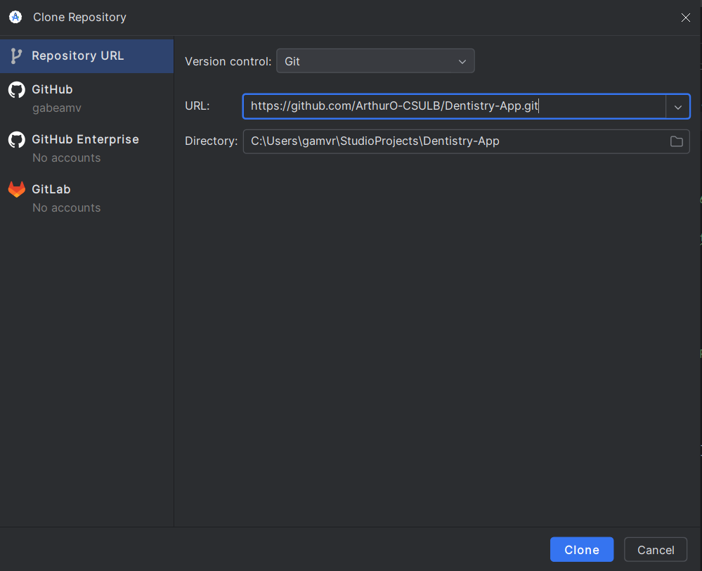
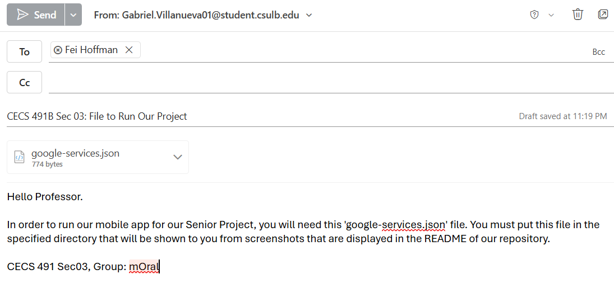
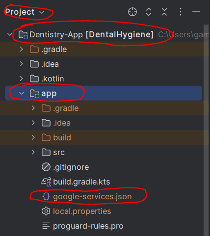

# mOral: The Dental Hygiene App
**Senior Project for CECS 491A and CECS491B.**

The app helps incentivize users to take care of their dental hygiene through features such as
a toothbrush timer, games, and awards. Users must make an account to utilize these features

## Instructions for Fei Hoffman to run the app.
1. Use android studio to run the app. Clone the repository as such.
]
2. We have emailed you a file called 'google-services.json' which you will need to run the app.

3. Change how you view the project directory to 'Project'. Afterwards, copy/move the file into
    the 'app' directory.
)
4. Run the project. We recommend using Medium Phone, API 35 to run the app.